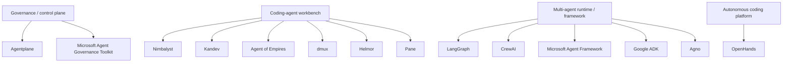
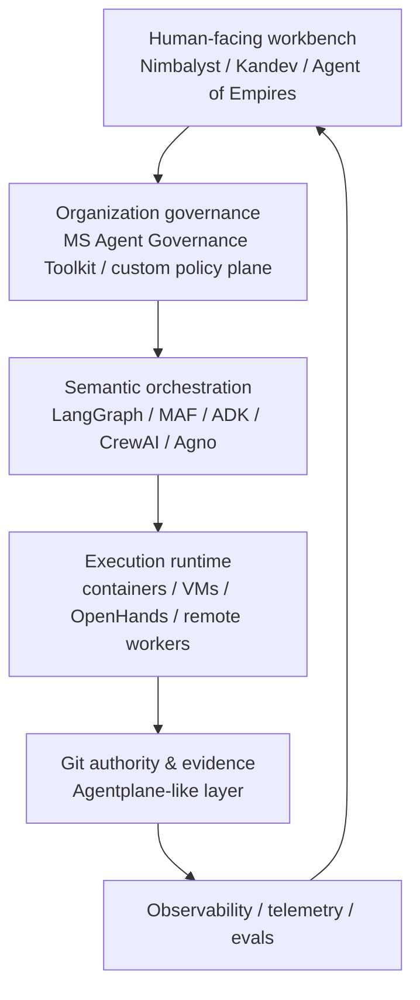

# Контроль и оркестрация команд AI-агентов: Agentplane, Nimbalyst и альтернативы

Дата исследования: 2026-08-24

## Executive summary

Рынок инструментов для управления AI-агентами уже разделился минимум на четыре разных класса продуктов, которые нельзя корректно сравнивать как прямые аналоги:

1. **Governance / agent control plane** — ограничения полномочий, policy enforcement, approvals, evidence, audit, lifecycle.
2. **Coding-agent workbench** — интерфейс для человека, который одновременно управляет многими Claude Code/Codex/OpenCode-сессиями.
3. **Multi-agent runtime/framework** — программная оркестрация собственных команд агентов внутри продукта.
4. **Autonomous coding platform** — готовая среда исполнения coding agents с sandbox/cloud/runtime.

Ключевой вывод: **Agentplane — действительно очень маленький по внешнему сообществу проект, но технически он не выглядит игрушечным.** Его архитектура существенно зрелее, чем можно ожидать от проекта с десятками stars: bounded work orders, fingerprint состояния, отделение заявлений агента от независимо наблюдаемого evidence, explicit approvals, recovery после ambiguous side effects, ACR (Agent Change Record), Git/worktree/PR lifecycle.

При этом риск пользователя обоснован: **экосистемный и bus-factor риск Agentplane высок.** На 24 августа 2026 года проект имел около 74 stars и 9 forks, оставался pre-1.0 и был создан только в январе 2026 года. Для enterprise-фундамента вокруг него одного строить систему рискованно.

Самый близкий крупный аналог по философии governance — **Microsoft Agent Governance Toolkit**. Он не Git-native и не заменяет Agentplane один-в-один, но гораздо сильнее в identity, policy enforcement, fleet governance, sandboxing/SRE и framework-neutral integrations.

Если задача — не governance, а управление десятками параллельных coding agents, наиболее интересны:

- **Agent of Empires** — сильный operator-first вариант с TUI + Web/PWA, HTTP API, контейнерными sandbox'ами и широкой поддержкой coding CLI;
- **Nimbalyst** — сильный visual workspace: Kanban, sessions, worktrees, Git, visual diff, Markdown/Mermaid/Excalidraw/CSV/code editors, mobile companion;
- **Kandev** — особенно интересен для remote/distributed execution: local, Docker, SSH, cloud/Sprites executors;
- **dmux** — очень простой и понятный terminal-first worktree multiplexer;
- **OpenHands** — существенно более крупный и зрелый стек, но уже другой класс: autonomous coding platform.

Для программной оркестрации собственных agent teams правильнее смотреть не на Agentplane/Nimbalyst, а на **LangGraph, Microsoft Agent Framework, Google ADK, CrewAI и Agno**.

---

## Карта рынка

Это разграничение критично. Agentplane отвечает прежде всего на вопрос:

> можно ли доверенно принять engineering change, произведённый агентом, и какие наблюдаемые факты нужны для этого?

LangGraph/CrewAI/ADK/MAF/Agno отвечают на вопрос:

> как программно организовать взаимодействие и workflow самих агентов?

Nimbalyst/Kandev/Agent of Empires/dmux отвечают:

> как человеку удобно управлять множеством coding-agent sessions?

---

# Agentplane

Источник: https://github.com/basilisk-labs/agentplane

## Что это на самом деле

Agentplane — не агентный framework и не GUI-мультиплексор. Это **Git-native control plane** между человеком, coding agent и Git/CI.

Основная идея: не пытаться сделать LLM детерминированной, а сделать детерминированным и инспектируемым контур вокруг неё.

Разделение ответственности примерно такое:

- человек задаёт intent и принимает materially risky decisions;
- coding agent выполняет semantic work — понимает задачу, проектирует решение, пишет код, оценивает результат;
- Agentplane владеет task state, permissions, write scope, Git/worktree/PR lifecycle, approvals, observed checks, evidence и recovery.

Проект описывает эту позицию как **mechanically authoritative, semantically blind**.

## Архитектурные сильные стороны

Ключевые контракты включают:

- `AgentWorkOrder`;
- `StateFingerprint`;
- `AgentSemanticResult`;
- `ExecutionReceipt`;
- `WorkflowStep`;
- `KnowledgeRef`;
- ACR / Agent Change Record.

Особенно сильная идея — разделение claims агента и независимо наблюдаемого evidence. Если агент пишет, что тесты прошли, это не автоматически становится supervisor-owned `checks`.

Каждый semantic episode получает bounded work order: objective, writable scope, релевантный context, output schema и точную команду resume. Если Git state, task revision, provider state или policy изменились, stale semantic result можно отвергнуть по fingerprint.

## Workflow

У проекта есть два базовых режима:

- `direct` — короткие, относительно обратимые local changes;
- `branch_pr` — отдельный worktree/branch, PR artifacts, hosted checks и integration handoff.

Agentplane может повышать строгость route, если policy или observed risk требуют более сильной изоляции.

Durable state намеренно хранится рядом с кодом: repository policy (`AGENTS.md` / `CLAUDE.md`), `.agentplane/WORKFLOW.md`, task README с machine-readable frontmatter, `acr.json`, PR artifacts.

## Security model

Сильные стороны:

- effect intent фиксируется до side effect;
- операция связывается с operation digest, `StateFingerprint`, state-scope digest, actor/policy и expiry;
- после ambiguous interruption операция не повторяется вслепую, а переходит в `effect_in_doubt` до reconciliation;
- есть формальная security policy.

Но важны ограничения: Agentplane **не заменяет kernel/container sandbox, workload identity, secrets broker или network isolation**. Документация прямо признаёт ограничения host-authority runners, Node filesystem TOCTOU и cross-clone coordination.

## Зрелость

Snapshot на 24 августа 2026:

- ~74 stars;
- ~9 forks;
- MIT;
- TypeScript;
- создан 27 января 2026;
- active push 24 августа 2026;
- pre-1.0.

### Вывод

**Архитектурная зрелость Agentplane заметно выше зрелости его экосистемы.**

Риск проекта не в том, что идея слабая. Риск — в концентрации maintainership, маленьком adoption footprint и возможном churn API/contracts до 1.0.

Для пилота или как repo-local Git governance/evidence component проект интересен. Как единственный enterprise control plane — пока слишком рискован.

---

# Прямые и частичные альтернативы Agentplane

## Microsoft Agent Governance Toolkit

GitHub: https://github.com/microsoft/agent-governance-toolkit

Наиболее близкий крупный проект **по governance-философии**, но не по конкретному Git-native workflow.

Сильнее Agentplane в:

- identity/trust;
- deterministic policy interception;
- fleet governance;
- sandbox/security model;
- lifecycle/SRE;
- audit;
- framework-neutral integrations;
- shadow-AI discovery.

Snapshot исследования: около 6.1k stars / 1k+ forks. Release v3.7.0 находился в статусе Public Preview.

Слабее Agentplane именно в узкой задаче превращения coding task в Git-visible bounded execution → verification → ACR.

**Вердикт:** лучший крупный governance-компаратор и хорошая основа для organization-wide policy plane. Не drop-in замена Agentplane.

## OpenHands

GitHub: https://github.com/All-Hands-AI/OpenHands

OpenHands — намного более крупный проект и уже полноценная autonomous coding platform.

Сильнее:

- полноценный coding-agent runtime;
- sandbox execution;
- cloud / enterprise deployment;
- огромная community;
- масштабирование autonomous coding jobs;
- широкая экосистема моделей и integrations.

Snapshot исследования: около 85k stars / 11k forks.

Но это другой слой. OpenHands не специализируется на Git evidence/governance так узко, как Agentplane.

Licensing nuance: OSS core в основном MIT, но OpenHands Cloud имеет отдельные лицензионные ограничения (PolyForm Free Trial).

**Вердикт:** если хочется заменить весь coding-agent execution stack — очень сильный вариант. Если нужен именно supervisor/evidence layer поверх Codex/Claude Code — не прямой аналог.

## Kandev

GitHub: https://github.com/kdlbs/kandev

Интересен как продукт на стыке Agentplane и Nimbalyst.

Возможности:

- Kanban/UI;
- parallel agents;
- Git/worktrees;
- multi-repo tasks;
- editor/review;
- PR workflow;
- local process, Docker, SSH и remote/cloud executors.

Snapshot: около 685 stars / 98 forks, active development, AGPL-3.0.

**Вердикт:** функционально сильнее Agentplane в operator UX и distributed execution, но слабее по формальному evidence/authority model.

## Agent of Empires

GitHub: https://github.com/agent-of-empires/agent-of-empires

Operator-first coding-agent manager.

Сильные стороны:

- TUI + Web/PWA;
- CLI / HTTP API;
- worktrees;
- multi-repo workspace;
- Docker / Podman / Apple Containers;
- diff view;
- resumable sessions;
- remote mobile access;
- Claude Code, OpenCode, Codex CLI, Gemini CLI, Copilot CLI, Cursor и другие coding CLIs.

Snapshot: около 3.1k stars / 321 forks; MIT; 60+ contributors заявлено проектом.

**Вердикт:** очень сильный вариант для человека-оператора, управляющего большим количеством coding sessions. Но это не formal governance plane уровня Agentplane.

## dmux

GitHub: https://github.com/standardagents/dmux

Простая модель:

> один task → один tmux pane → один worktree/branch → merge/PR.

Snapshot: около 1.75k stars; MIT; active releases.

Преимущество — минимальный friction и простая mental model. Недостаток — почти отсутствует enterprise governance/evidence layer.

**Вердикт:** один из лучших lightweight terminal-first вариантов.

---

# Nimbalyst

GitHub: https://github.com/Nimbalyst/nimbalyst

Исследование однозначно идентифицировало актуальный Nimbalyst как visual workspace — преемник Crystal.

Crystal был deprecated в феврале 2026 года в пользу Nimbalyst.

## Что это

Nimbalyst — open-source TypeScript/Electron workspace для:

- Codex;
- Claude Code;
- OpenCode;
- Copilot.

Он объединяет:

- управление parallel sessions;
- Kanban task tracking;
- Git/worktrees;
- visual diff / approve-reject flow;
- terminal;
- Markdown;
- Mermaid;
- Excalidraw;
- CSV;
- data-model editors;
- Monaco code editor;
- mobile companion.

Это намного ближе к AI-native workbench/IDE, чем к control plane.

Snapshot исследования:

- ~1,558 stars;
- ~223 forks;
- MIT;
- ~560 open issues;
- active push 24 августа 2026;
- release line около v0.71.x.

Nimbalyst заметно крупнее Agentplane, но всё ещё не сравним по экосистеме с OpenHands, LangGraph или CrewAI.

---

# Аналоги Nimbalyst

## Agent of Empires

Для сценария «много coding agents, operator UX, remote access» Agent of Empires выглядит функционально сильнее Nimbalyst.

Преимущества:

- более широкий roster coding CLIs;
- TUI + Web/PWA;
- HTTP API;
- container isolation;
- remote phone access;
- multi-repo;
- более крупная community.

Nimbalyst сильнее там, где нужны встроенные visual documents, Mermaid, Excalidraw и richer desktop workspace.

## Kandev

Kandev меньше Nimbalyst по community, но функционально сильнее по remote/distributed execution:

- local executor;
- Docker;
- SSH;
- cloud/Sprites;
- multi-repository execution.

Для небольшой команды с удалёнными workers Kandev может быть более перспективным фундаментом, чем Nimbalyst.

## dmux

Популярность примерно сравнима/чуть выше, но продукт намного проще.

Плюс: минималистичность и прозрачность.

Минус: нет rich visual workspace.

## Helmor

GitHub: https://github.com/dohooo/helmor

Local-first multi-agent development workbench с worktree isolation, diff/editor/terminal и GitHub/GitLab-oriented workflows.

Snapshot: около 1.3k stars, Apache-2.0, active development.

## Pane

Terminal-first agent-agnostic environment для local/self-hosted remote operation, включая desktop/phone access.

Потенциально интересен как agent-neutral operator surface, но перед корпоративным внедрением стоит отдельно проверить актуальный LICENSE: metadata и project materials на момент исследования не полностью совпадали.

## Claude Squad

GitHub: https://github.com/smtg-ai/claude-squad

Исторически популярный lightweight session/worktree multiplexer: около 7.6k stars в исследованном snapshot.

Существенно популярнее Nimbalyst, но намного ближе к terminal/worktree manager, чем к visual collaborative workspace.

## Vibe Kanban

GitHub: https://github.com/BloopAI/vibe-kanban

Исторически огромный footprint — около 27k stars — но upstream объявил проект sunsetting.

**Не стоит выбирать как основу новой долгоживущей системы**, несмотря на популярность. Полезен как источник product/UX идей.

## OpenHands

OpenHands радикально превосходит Nimbalyst по scale/community и autonomous execution, но относится к другому классу.

Если задача: «запустить большое количество автономных coding jobs в sandbox/cloud» — OpenHands намного ближе к цели.

Если задача: «человеку визуально вести задачи, документы, diagrams и одновременно управлять Claude/Codex sessions» — Nimbalyst ближе по UX.

---

# Multi-agent runtimes — не путать с control plane

## LangGraph

GitHub: https://github.com/langchain-ai/langgraph

Около 40k stars в snapshot. Durable graph/state-oriented multi-agent framework с огромной LangChain ecosystem.

Использовать, если нужна программируемая orchestration/state machine для собственных agents.

## CrewAI

GitHub: https://github.com/crewAIInc/crewAI

Около 57k stars. High-level role/team oriented agent framework.

## Microsoft Agent Framework

GitHub: https://github.com/microsoft/agent-framework

Около 13k stars. Python/.NET framework для building, orchestrating и deploying agents/workflows.

## Google ADK

GitHub: https://github.com/google/adk-python

Около 21k stars. Code-first toolkit для building/evaluating/deploying sophisticated agents.

## Agno

GitHub: https://github.com/agno-agi/agno

Около 42k stars. Agents/teams/workflows + platform/runtime/API orientation.

Эти продукты не надо выбирать «вместо Agentplane» — их логичнее комбинировать с governance/operator layers.

---

# GitHub/community snapshot

Значения отражают snapshot исследования на 24 августа 2026 года и предназначены прежде всего для сравнительной оценки масштаба, а не как вечные точные числа.

| Проект | Примерный масштаб | Основной класс | Лицензия / nuance |
|---|---:|---|---|
| Agentplane | 74 stars | Git-native governance/control | MIT |
| Nimbalyst | 1.56k | Visual coding-agent workbench | MIT |
| Kandev | 685 | Coding-agent workbench/execution | AGPL-3.0 |
| dmux | 1.75k | Terminal worktree multiplexer | MIT |
| Agent of Empires | 3.1k | Coding-agent manager | MIT |
| Helmor | 1.3k | Local multi-agent workbench | Apache-2.0 |
| MS Agent Governance Toolkit | 6.1k | Enterprise governance | MIT |
| OpenHands | ~85k | Autonomous coding platform | OSS core mostly MIT; Cloud separate |
| CrewAI | ~57.5k | Multi-agent runtime | MIT |
| LangGraph | ~40k | Multi-agent runtime | MIT |
| Microsoft Agent Framework | ~13k | Agent framework | MIT |
| Google ADK | ~21k | Agent SDK/runtime | Apache-2.0 |
| Agno | ~42k | Agent platform/runtime | Apache-2.0 |

Stars сами по себе не являются достаточным критерием. Для выбора важнее одновременно смотреть:

- commit/release freshness;
- число активных maintainers;
- external contributors;
- issue/PR response time;
- bus factor;
- production adoption signals;
- security policy;
- backwards compatibility / pre-1.0 churn;
- deployment model;
- licensing boundaries;
- extensibility;
- dependency on proprietary cloud surface.

---

# Functional matrix

Оценки ниже — качественная нормализация, а не vendor benchmark.

| Проект | Git/worktree control | Formal policy/HITL | Audit/evidence | Parallel-agent UX | Distributed execution | Framework neutrality |
|---|---:|---:|---:|---:|---:|---:|
| Agentplane | ●●● | ●●● | ●●● | ● | ● | ●● |
| MS Agent Governance Toolkit | ● | ●●● | ●●● | ● | ●●● | ●●● |
| OpenHands | ●● | ●● | ●● | ●● | ●●● | ●● |
| Nimbalyst | ●●● | ●● | ● | ●●● | ●● | ●● |
| Kandev | ●●● | ●● | ●● | ●●● | ●●● | ●● |
| Agent of Empires | ●●● | ● | ● | ●●● | ●● | ●●● |
| dmux | ●●● | ● | ● | ●●● | ● | ●● |
| LangGraph | ○ | ●● | ●● | ●●●* | ●●● | ●●● |
| CrewAI | ○ | ●● | ●● | ●●●* | ●●● | ●●● |
| Microsoft Agent Framework | ○ | ●● | ●● | ●●●* | ●●● | ●●● |
| Google ADK | ○ | ●● | ●● | ●●●* | ●●● | ●●● |
| Agno | ○ | ●● | ●● | ●●●* | ●●● | ●●● |

`*` Для frameworks parallel-agent UX означает программную orchestration agent teams, а не обязательно human-facing coding dashboard.

---

# Рекомендованный shortlist

## 1. Microsoft Agent Governance Toolkit

Выбирать, если главный вопрос — **enterprise governance, identity, policy, sandboxing, audit и fleet control** для разнородных agents.

Не заменяет Git-specific evidence workflow Agentplane, но намного более устойчив как organization-level foundation.

## 2. Agent of Empires

Выбирать, если нужно **операционно управлять большим числом Claude Code/Codex/OpenCode/Gemini/Copilot/Cursor sessions** из TUI/Web/mobile и нужен API + container support.

Наиболее интересный кандидат как более крупная альтернатива human-facing части Nimbalyst.

## 3. Kandev

Выбирать, если нужны **parallel agents + Kanban + multi-repo + Docker/SSH/cloud execution**.

Особенно перспективен как team workbench, если agents исполняются не только локально.

## 4. OpenHands

Выбирать, если нужен не supervisor над существующими coding CLIs, а **полноценный автономный coding runtime/platform** с sandbox и cloud-oriented execution.

## 5. Agentplane

Несмотря на размер, сохраняет место в shortlist, если нужна именно **строгая Git-native authority/evidence модель**.

Лучший способ использовать его сейчас — не делать единственным enterprise foundation, а рассматривать как специализированный repo-level policy/evidence component поверх более крупной execution/governance архитектуры.

---

# Рекомендуемая layered architecture

Наиболее перспективная архитектура для серьёзной системы управления командами AI-агентов выглядит не как выбор одного продукта, а как набор слоёв:

Именно такой подход снимает главную проблему монолитных решений: operator UX, semantic orchestration, security governance, execution sandboxing и Git evidence имеют разные требования и меняются с разной скоростью.

---

# Красные флаги / due diligence перед внедрением

Перед тем как делать любой из проектов фундаментом системы, проверить:

1. **Bus factor:** сколько maintainers реально merge'ят PR и выпускают релизы за последние 90–180 дней.
2. **Release cadence:** есть ли стабильные releases, changelog, migration policy.
3. **API stability:** pre-1.0 или стабильные contracts; наличие compatibility guarantees.
4. **Issue hygiene:** median response time, доля stale issues, скорость закрытия regressions.
5. **Security:** SECURITY.md, private disclosure path, CVE process, dependency scanning.
6. **Isolation model:** process-only, containers, VM/microVM, network isolation, filesystem boundary.
7. **Secrets:** как agents получают credentials; есть ли short-lived/workload identity.
8. **Approvals:** можно ли механически запретить side effects до human/policy approval.
9. **Evidence:** различаются ли agent claims и supervisor-observed facts.
10. **Recovery:** что происходит при crash/network timeout в момент side effect.
11. **Distributed locking:** как предотвращается двойной запуск task в разных workers/clones.
12. **Multi-tenancy/RBAC:** project/team/organization boundaries.
13. **Auditability:** immutable event log, trace IDs, Git/PR linkage, OpenTelemetry/export.
14. **Agent neutrality:** насколько глубоко продукт привязан к одному provider/CLI.
15. **Licensing:** MIT/Apache/AGPL/PolyForm и отдельные ограничения cloud/enterprise частей.
16. **Data egress/privacy:** telemetry по умолчанию, prompts/source code/chat content.
17. **Self-hosting reality:** полностью ли self-hosted critical path или часть функций остаётся SaaS-only.
18. **Extensibility:** executor/provider/plugin SDK, MCP/A2A/API/webhooks.
19. **Production evidence:** реальные компании, public case studies, long-running deployments.
20. **Exit strategy:** можно ли вынести task state, logs, Git metadata и policies без vendor lock-in.

---

# Итоговый вывод

Первоначальное сомнение относительно Agentplane оправдано только наполовину.

**Да, Agentplane очень маленький по community и это реальный operational/business risk. Но архитектурно это один из самых интересных специализированных Git-native control-plane проектов в исследованной группе.** Его не стоит отбрасывать только по stars.

При этом поиск «такого же, только в 100 раз крупнее» не дал идеального drop-in аналога, потому что крупные проекты обычно закрывают соседние слои:

- Microsoft Agent Governance Toolkit — enterprise governance;
- OpenHands — autonomous coding platform;
- LangGraph / MAF / ADK / CrewAI / Agno — semantic multi-agent runtime;
- Nimbalyst / Kandev / Agent of Empires / dmux — human-facing coding-agent workbench.

Поэтому для собственного **agent-control-plane** наиболее рациональная стратегия — не клонировать один upstream целиком, а собирать архитектурный фундамент из лучших идей разных классов:

- от Agentplane — bounded authority, evidence, fingerprints, recovery и Git-visible ACR;
- от Microsoft governance — identity/policy/fleet/security;
- от Kandev/OpenHands — remote/distributed sandbox execution;
- от Nimbalyst/Agent of Empires — operator UX;
- от LangGraph/MAF/ADK — semantic orchestration contracts;
- поверх этого — единая telemetry/evals plane.

Это выглядит значительно устойчивее, чем делать ставку на один молодой проект.

---

# Ключевые источники

- Agentplane — https://github.com/basilisk-labs/agentplane
- Agentplane roadmap — https://github.com/basilisk-labs/agentplane/blob/main/ROADMAP.md
- Agentplane Hermes plugin — https://github.com/basilisk-labs/agentplane-hermes-plugin
- Microsoft Agent Governance Toolkit — https://github.com/microsoft/agent-governance-toolkit
- Microsoft Agent Governance Toolkit releases — https://github.com/microsoft/agent-governance-toolkit/releases
- OpenHands — https://github.com/All-Hands-AI/OpenHands
- OpenHands Cloud — https://github.com/OpenHands/OpenHands-Cloud
- Nimbalyst — https://github.com/Nimbalyst/nimbalyst
- Nimbalyst releases — https://github.com/Nimbalyst/nimbalyst/releases
- Crystal/Nimbalyst predecessor — https://github.com/acumenix/crystal-Nimbalyst
- Kandev — https://github.com/kdlbs/kandev
- Agent of Empires — https://github.com/agent-of-empires/agent-of-empires
- dmux — https://github.com/standardagents/dmux
- Claude Squad — https://github.com/smtg-ai/claude-squad
- Vibe Kanban — https://github.com/BloopAI/vibe-kanban
- LangGraph — https://github.com/langchain-ai/langgraph
- CrewAI — https://github.com/crewAIInc/crewAI
- Microsoft Agent Framework — https://github.com/microsoft/agent-framework
- Google ADK — https://github.com/google/adk-python
- Agno — https://github.com/agno-agi/agno
